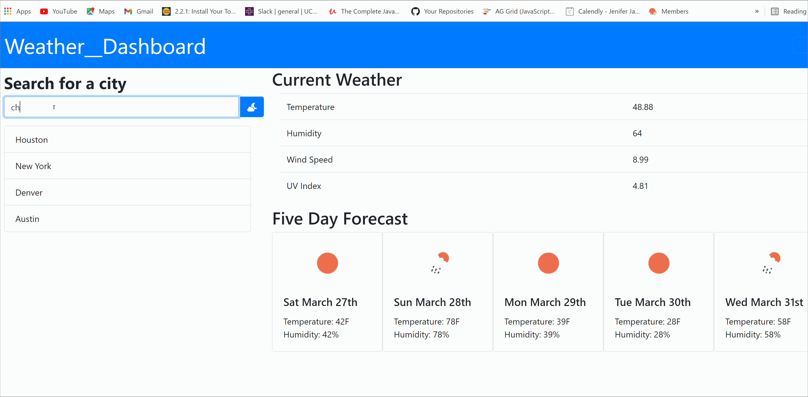

# weather
a weather dashboard showing a 5 days forecast by city using open weather API

# Name 
 Weather Dashboard

# requirements
you will be able to see the weather outlook for multiple cities
present with the city name, the date, an icon representation of weather conditions, the temperature, the humidity, the wind speed, and the UV index
 presente with a 5-day forecast that displays the date, an icon representation of weather conditions, the temperature, and the humidity

# install
clone the repo

# example 

 
# repo
https://fadhaa89.github.io/weather/.

# deployed

# author 
name : Fadhaa Abdullah  
Email: fadhaaabdullah8991@gmail.com    
Github page : Fadhaa89
